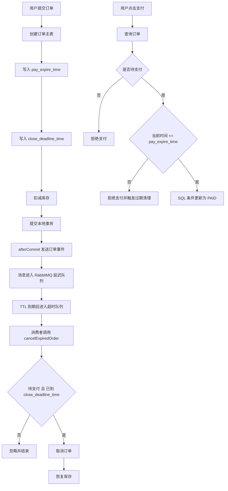
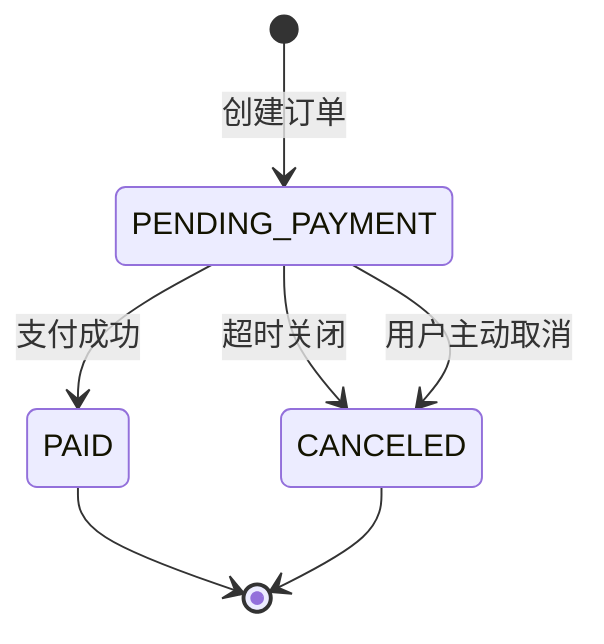

# 订单支付超时关闭

> 这是一个项目案例设计笔记：用订单支付超时关闭串起 Spring 事务、MySQL 条件更新、RabbitMQ 延迟队列、死信队列、消费幂等和前端倒计时。

## 要解决的问题

电商订单创建后，一般会给用户一段支付时间。

比如：

```text
订单创建后 15 分钟内可以支付。
超过 15 分钟，订单自动关闭，库存恢复。
```

看起来很简单，但工程上会遇到一个典型问题：

```text
前端倒计时显示 15 分钟。
后端 RabbitMQ 16 分钟后才触发取消。

那用户在第 15 分钟之后、第 16 分钟之前，还能不能支付？
```

如果只用 MQ 什么时候取消订单来判断是否能支付，就会出现设计歧义：

```text
MQ 多出来的 1 分钟，到底是给用户支付的，还是给系统清理的？
```

正确设计应该把两个概念拆开：

```text
用户支付截止时间：决定用户还能不能付款。
后台关闭截止时间：决定系统什么时候自动清理订单。
```

所以这个案例的核心不是“做一个延迟队列”，而是：

```text
业务权限判断不要依赖异步清理。
```

## 时间字段设计

订单表存两个时间：

```text
pay_expire_time       用户支付硬截止时间
close_deadline_time   后台自动关闭截止时间
```

规则：

```text
订单创建时间：create_time
支付截止时间：pay_expire_time = create_time + 15 分钟
后台关闭时间：close_deadline_time = pay_expire_time + 1 分钟
```

职责拆分：

| 字段 | 给谁用 | 作用 |
| --- | --- | --- |
| `pay_expire_time` | 前端、支付接口 | 判断用户还能不能支付 |
| `close_deadline_time` | MQ 消费者、兜底任务 | 判断系统能不能自动关闭订单 |

规则很简单：

```text
用户能否支付，只看 pay_expire_time。
系统何时清理，只看 close_deadline_time。
```

多出来的 1 分钟是系统缓冲，不是隐藏支付时间。

## 整体流程



这个流程有三个关键边界：

- 支付权限由 `pay_expire_time` 决定。
- 自动清理由 `close_deadline_time` 决定。
- 重复 MQ 消息由状态条件更新兜住。

## 数据库设计

### 订单表字段

订单表需要保存具体截止时间，而不是每次临时计算。

```sql
pay_expire_time datetime not null,
close_deadline_time datetime not null
```

含义：

```text
pay_expire_time:
    用户可见的支付截止时间。
    前端倒计时展示它。
    支付接口必须用它做硬校验。

close_deadline_time:
    后台自动关闭时间。
    通常比 pay_expire_time 晚一点。
    只给 MQ 或定时任务清理使用，不展示给用户。
```

### 为什么不直接用 `create_time + 15 分钟`

短期可以这样写：

```java
LocalDateTime payExpireTime = order.getCreateTime().plusMinutes(15);
```

但这会把业务规则写死在代码里。

后续如果有这些需求，就会很难处理：

- 普通订单 15 分钟过期。
- 秒杀订单 5 分钟过期。
- 预售订单 30 分钟过期。
- 大促期间临时调整支付时长。
- 历史订单不能被新配置影响。

更稳的方式是订单创建时直接固化规则：

```text
这笔订单的支付截止时间就是 pay_expire_time。
```

这样前端、后端、MQ 都围绕同一个具体时间点工作。

### 索引设计

后台清理一般会查待支付且已经到关闭时间的订单：

```sql
select *
from orders
where status = 'PENDING_PAYMENT'
  and close_deadline_time <= now()
limit 100;
```

所以可以建联合索引：

```sql
create index idx_orders_status_close_deadline
    on orders (status, close_deadline_time);
```

索引顺序的原因：

```text
status:
    先过滤待支付订单。

close_deadline_time:
    再按关闭截止时间范围扫描。
```

即使当前主要靠 MQ 触发取消，这个索引也可以给后续兜底扫描使用。

## 订单状态机

这个案例里至少有这些状态：

```text
PENDING_PAYMENT  待支付
PAID             已支付
CANCELED         已取消
```

核心状态流转：



注意：

```text
PAID 不能再被超时关闭。
CANCELED 不能再被支付。
```

所以支付和取消都必须是条件更新。

## 订单创建流程

订单创建一般包含这些操作：

```text
创建 orders
创建 order_items
扣减库存
清理购物车
提交事务
发送订单创建消息
发送订单超时消息
```

推荐写成一个本地事务：

```java
@Transactional(rollbackFor = Exception.class)
public Long createOrder(Long userId, CreateOrderRequest request) {
    LocalDateTime now = LocalDateTime.now();
    LocalDateTime payExpireTime = now.plus(PAYMENT_TIMEOUT);
    LocalDateTime closeDeadlineTime = payExpireTime.plus(AUTO_CANCEL_GRACE);

    OrderDO order = new OrderDO();
    order.setUserId(userId);
    order.setStatus("PENDING_PAYMENT");
    order.setPayExpireTime(payExpireTime);
    order.setCloseDeadlineTime(closeDeadlineTime);
    order.setCreateTime(now);
    order.setUpdateTime(now);

    orderMapper.insert(order);
    orderItemMapper.batchInsert(order.getId(), request.getItems());
    productStockService.deductStock(request.getItems());
    cartService.removeCheckedItems(userId);

    OrderCreatedEvent event = OrderCreatedEvent.of(order, userId, now);
    registerAfterCommitSend(event);

    return order.getId();
}
```

这里有两个细节。

第一，`createTime`、`payExpireTime`、`closeDeadlineTime`、事件时间最好来自同一个 `now`。

这样不会出现：

```text
create_time 是数据库 now()
pay_expire_time 是 Java now() + 15 分钟
事件 occurredAt 又是另一个 now()
```

误差通常不大，但订单状态机里同源时间更清晰。

第二，MQ 消息不要在事务提交前发送。

## 事务提交后发送 MQ

如果订单事务还没提交就发送 MQ，可能出现：

```text
MQ 消息已经发出。
数据库事务回滚。
消费者收到消息后查不到订单。
```

所以应该在事务提交后再发送：

```java
private void registerAfterCommitSend(OrderCreatedEvent event) {
    TransactionSynchronizationManager.registerSynchronization(new TransactionSynchronization() {
        @Override
        public void afterCommit() {
            rabbitTemplate.convertAndSend(
                    RabbitMqConfig.ORDER_EXCHANGE,
                    RabbitMqConfig.ORDER_CREATED_ROUTING_KEY,
                    event
            );

            rabbitTemplate.convertAndSend(
                    RabbitMqConfig.ORDER_EXCHANGE,
                    RabbitMqConfig.ORDER_TIMEOUT_DELAY_ROUTING_KEY,
                    event
            );
        }
    });
}
```

`afterCommit()` 解决的是：

```text
只有订单事务真正提交成功，才发送 MQ。
```

但它不是最终可靠投递方案。

因为还可能发生：

```text
数据库事务提交成功。
afterCommit 准备发 MQ。
应用刚好崩溃。
消息没有发出去。
```

更强的做法是本地消息表，也就是 outbox：

```text
订单事务内写 orders + order_items + message_outbox
事务提交后异步任务扫描 outbox
发送 MQ 成功后标记 SENT
失败继续重试
```

当前项目如果是学习版，用 `afterCommit()` 是合理的第一步；如果是工业级核心交易链路，要继续演进到 outbox。

相关笔记可以看：

- [Spring 事务同步与 MQ](/notes/rabbitmq/transaction-after-commit)
- [MQ 消费幂等](/notes/rabbitmq/message-idempotency)

## RabbitMQ 超时取消设计

### 拓扑结构

这个案例使用：

```text
TTL + Dead Letter Exchange
```

实现延迟取消。

拓扑可以这样设计：

```text
DirectExchange:
    flashmart.order.exchange

延迟队列:
    flashmart.order.timeout.delay.queue

真正消费队列:
    flashmart.order.timeout.queue
```

消息流向：

```text
订单创建事件
  -> order exchange
  -> timeout delay queue
  -> 等待 x-message-ttl
  -> TTL 到期
  -> dead-letter 到 order exchange
  -> timeout queue
  -> timeout consumer 消费
```

### 延迟队列参数

核心配置：

```java
Map<String, Object> args = new HashMap<>();
args.put("x-message-ttl", ORDER_TIMEOUT_DELAY_MILLIS);
args.put("x-dead-letter-exchange", ORDER_EXCHANGE);
args.put("x-dead-letter-routing-key", ORDER_TIMEOUT_ROUTING_KEY);
```

含义：

| 参数 | 含义 |
| --- | --- |
| `x-message-ttl` | 消息在这个队列里最多存活多久，单位毫秒 |
| `x-dead-letter-exchange` | 消息过期后转发到哪个交换机 |
| `x-dead-letter-routing-key` | 消息过期后使用哪个 routing key 转发 |

这里的延迟队列不要被消费者监听。

消费者应该监听真正的超时队列：

```text
flashmart.order.timeout.queue
```

### 为什么 MQ 延迟是 16 分钟

如果规则是：

```text
用户支付时间：15 分钟
系统缓冲时间：1 分钟
```

那么：

```java
private static final Duration PAYMENT_TIMEOUT = Duration.ofMinutes(15);
private static final Duration AUTO_CANCEL_GRACE = Duration.ofMinutes(1);
private static final int ORDER_TIMEOUT_DELAY_MILLIS = 16 * 60 * 1000;
```

注意：

```text
16 分钟不是用户支付时间。
16 分钟只是后台清理触发时间。
```

用户能不能支付，必须看 `pay_expire_time`。

MQ 只是异步清理机制，不是支付权限判断机制。

相关笔记可以看：

- [RabbitMQ 延迟队列](/notes/rabbitmq/delay-queue)
- [RabbitMQ 死信队列](/notes/rabbitmq/dead-letter-queue)

## 支付接口设计

支付接口必须主动校验支付截止时间。

不要写成：

```text
只要订单还是 PENDING_PAYMENT，就允许支付。
```

因为 MQ 可能延迟，订单可能已经超过 `pay_expire_time`，但还没被后台清理成 `CANCELED`。

推荐流程：

```java
@Override
@Transactional(rollbackFor = Exception.class)
public void payOrder(Long userId, Long orderId) {
    OrderDetailVO order = orderMapper.selectOrderDetail(userId, orderId);
    if (order == null) {
        throw new BusinessException(404, "订单不存在");
    }

    if (!ORDER_STATUS_PENDING_PAYMENT.equals(order.getStatus())) {
        throw new BusinessException("订单不存在或当前状态不可支付");
    }

    if (LocalDateTime.now().isAfter(order.getPayExpireTime())) {
        cancelExpiredOrder(userId, orderId);
        throw new BusinessException("订单已超时，请重新下单");
    }

    int affected = orderMapper.payOrder(userId, orderId);
    if (affected == 0) {
        cancelExpiredOrder(userId, orderId);
        throw new BusinessException("订单已超时或当前状态不可支付");
    }
}
```

这里有两层判断。

Java 层判断：

```text
订单是否存在。
订单是否待支付。
当前时间是否超过 pay_expire_time。
```

SQL 层最终兜底：

```sql
update orders
set status = 'PAID',
    pay_time = now(),
    update_time = now()
where id = #{orderId}
  and user_id = #{userId}
  and status = 'PENDING_PAYMENT'
  and pay_expire_time >= now()
```

为什么 Java 判断后，SQL 还要判断？

因为有并发窗口：

```text
T1: Java 查询订单，发现还没过期。
T2: 过了几毫秒，订单刚好过期。
T3: Java 执行 update。
```

如果 SQL 没有：

```sql
and pay_expire_time >= now()
```

就可能把已经过期的订单更新成已支付。

工程里常见做法是：

```text
Java 层做业务语义判断。
SQL 层做最终原子条件保护。
```

## 超时取消接口设计

MQ 消费者不应该直接写一堆订单业务逻辑。

消费者只负责接消息，然后调用订单服务：

```java
@RabbitListener(queues = RabbitMqConfig.ORDER_TIMEOUT_QUEUE)
public void handleOrderTimeoutMessage(OrderCreatedEvent event) {
    orderService.cancelExpiredOrder(event.getUserId(), event.getOrderId());
    log.info("订单超时检查完成，orderId={}", event.getOrderId());
}
```

真正判断是否取消，放在订单服务里：

```java
@Override
@Transactional(rollbackFor = Exception.class)
public void cancelExpiredOrder(Long userId, Long orderId) {
    OrderDetailVO order = orderMapper.selectOrderDetail(userId, orderId);
    if (order == null || !ORDER_STATUS_PENDING_PAYMENT.equals(order.getStatus())) {
        return;
    }

    if (LocalDateTime.now().isBefore(order.getCloseDeadlineTime())) {
        return;
    }

    List<OrderItemVO> items = orderMapper.selectOrderItems(orderId);
    if (items.isEmpty()) {
        throw new BusinessException("订单明细不存在");
    }

    int affected = orderMapper.cancelOrder(userId, orderId);
    if (affected == 0) {
        return;
    }

    restoreStock(items);
}
```

这段代码有三个关键点。

第一，不是待支付订单直接返回：

```text
订单可能已经支付。
订单可能已经被用户主动取消。
MQ 也可能重复投递。
```

这些情况都不是异常，不应该让 MQ 继续重试。

第二，没到 `close_deadline_time` 不能取消：

```text
即使消息提前到了，也不能误取消订单。
```

正常 TTL 不应该提前，但业务服务里多做一层判断，能兜住配置变更、旧消息、人工补偿等异常情况。

第三，恢复库存必须放在条件取消成功之后。

```sql
update orders
set status = 'CANCELED',
    cancel_time = now(),
    update_time = now()
where id = #{orderId}
  and user_id = #{userId}
  and status = 'PENDING_PAYMENT'
```

只有 `affected = 1` 才恢复库存。

这样重复消费时：

```text
第一次消费：
    PENDING_PAYMENT -> CANCELED
    affected = 1
    恢复库存

第二次消费：
    status 已经是 CANCELED
    affected = 0
    不恢复库存
```

这就是订单取消的幂等。

## 并发场景怎么兜

### 用户支付和 MQ 取消同时发生

可能发生：

```text
线程 A：用户支付
线程 B：MQ 超时取消
```

支付 SQL：

```sql
where status = 'PENDING_PAYMENT'
  and pay_expire_time >= now()
```

取消 SQL：

```sql
where status = 'PENDING_PAYMENT'
```

最终只有一个能成功更新状态。

如果支付先成功：

```text
订单变成 PAID。
取消 SQL affected = 0。
不会恢复库存。
```

如果取消先成功：

```text
订单变成 CANCELED。
支付 SQL affected = 0。
支付失败。
```

这里不需要分布式锁，状态条件更新就是并发防线。

### MQ 消息晚到

可能发生：

```text
订单 16 分钟应该关闭。
RabbitMQ 堆积，20 分钟才消费。
```

没问题。

支付接口在 15 分钟后已经不能支付。

MQ 晚一点只是晚一点清理订单。

### MQ 消息重复

可能发生：

```text
消费者处理成功。
还没 ack 就重启。
消息重新投递。
```

没问题。

取消逻辑先判断状态，再条件更新。

重复消息不会重复恢复库存。

### MQ 消息提前到

理论上 TTL 不应提前，但工程上要考虑旧消息、手动投递、配置错误。

所以取消逻辑里还要判断：

```java
if (LocalDateTime.now().isBefore(order.getCloseDeadlineTime())) {
    return;
}
```

这样即使消息提前到了，也不会取消未到关闭时间的订单。

### 用户卡在最后 1 秒点击支付

有两个合理结果。

如果后端收到请求并执行 SQL 时还没超过 `pay_expire_time`：

```text
允许支付。
```

如果后端执行 SQL 时已经超过 `pay_expire_time`：

```text
拒绝支付。
```

最终以服务端时间和 SQL 条件为准，不以前端页面剩余秒数为准。

## 前端倒计时设计

前端应该展示 `pay_expire_time`，不要展示 `close_deadline_time`。

订单详情类型可以带两个字段：

```ts
export interface OrderDetail {
    orderId: number
    orderNo: string
    status: string
    payExpireTime: string
    closeDeadlineTime: string
    createTime: string
    items: OrderItem[]
}
```

但用户界面只用：

```text
payExpireTime
```

倒计时工具：

```ts
export function getOrderPaymentRemainingSeconds(payExpireTime: string, now = Date.now()) {
    const normalizedPayExpireTime = payExpireTime.replace(' ', 'T')
    const deadlineTimestamp = Date.parse(normalizedPayExpireTime)

    if (Number.isNaN(deadlineTimestamp)) {
        return null
    }

    return Math.max(0, Math.ceil((deadlineTimestamp - now) / 1000))
}
```

支付按钮：

```ts
const isPendingPayment = computed(() => order.value?.status === 'PENDING_PAYMENT')

const paymentRemainingSeconds = computed(() => {
    if (!order.value || !isPendingPayment.value) {
        return null
    }

    return getOrderPaymentRemainingSeconds(order.value.payExpireTime, now.value)
})

const canPay = computed(() => {
    return isPendingPayment.value && (paymentRemainingSeconds.value ?? 0) > 0
})
```

前端只做用户体验：

```text
隐藏或禁用支付按钮。
展示剩余时间。
提示订单已超时。
```

真正的安全边界永远在后端：

```text
payOrder() + SQL 条件更新。
```

## 为什么这是分层防御

这个设计不是重复判断，而是不同层各做自己的事。

| 层 | 防什么 |
| --- | --- |
| 前端倒计时 | 减少用户误操作 |
| Java 支付判断 | 清晰表达业务规则 |
| SQL 条件更新 | 防并发边界穿透 |
| MQ 延迟消息 | 异步触发后台清理 |
| 取消条件更新 | 防重复取消、重复回补库存 |
| 兜底扫描 | 防 MQ 丢失、堆积、服务停机 |

整体职责划分：

```text
前端负责体验。
接口负责规则。
SQL 负责原子性。
MQ 负责异步清理。
幂等负责重复投递。
```

## 真实支付系统还缺什么

当前案例是：

```text
模拟支付 + 订单超时关闭。
```

真实支付系统不能直接：

```text
点击支付 -> orders.status = PAID
```

后续应该拆出支付单。

### 支付单表

可以新增：

```text
payment_order
```

字段示例：

```sql
id bigint primary key,
payment_no varchar(64) not null,
order_id bigint not null,
user_id bigint not null,
amount decimal(10, 2) not null,
status varchar(32) not null,
channel varchar(32) not null,
third_trade_no varchar(128),
expire_time datetime not null,
pay_time datetime,
create_time datetime not null,
update_time datetime not null,
unique key uk_payment_no (payment_no),
unique key uk_order_channel (order_id, channel)
```

真实流程会变成：

```text
用户点击支付
  -> 创建 payment_order
  -> 跳转第三方收银台
  -> 第三方支付成功
  -> 回调后端
  -> 验签
  -> 根据 payment_no 幂等处理回调
  -> 更新 payment_order 为 PAID
  -> 更新 orders 为 PAID
```

### 支付回调幂等

第三方回调也可能重复。

所以回调接口必须幂等：

```text
同一个 third_trade_no 只能成功处理一次。
同一个 payment_no 已经 PAID，再次回调直接返回成功。
订单已经 PAID，不重复发 MQ、不重复加积分。
```

### 对账

真实支付还需要对账。

因为可能出现：

```text
第三方支付成功。
后端没有收到回调。
```

这时需要定时查询第三方账单或交易状态，再补偿本地状态。

## 后续增强方向

### 本地消息表 outbox

当前 `afterCommit()` 比事务内发送 MQ 好，但还不是最强。

更强方案：

```text
订单事务内写 message_outbox。
定时任务扫描 NEW 消息。
发送 MQ。
收到 confirm 后标记 SENT。
失败重试。
```

这样可以兜住：

```text
事务提交后，MQ 发送前应用崩溃。
```

### 兜底扫描任务

即使使用 MQ，也建议保留兜底任务：

```sql
select id
from orders
where status = 'PENDING_PAYMENT'
  and close_deadline_time <= now()
order by close_deadline_time
limit 100;
```

用途：

- MQ 服务异常。
- 消息没有发送成功。
- 消费者长时间停机。
- 人工修复历史异常订单。

### 不同订单不同过期时间

可以把订单超时策略配置化：

```text
普通订单：15 分钟
秒杀订单：5 分钟
预售订单：30 分钟
```

创建订单时根据业务类型写入不同的 `pay_expire_time`。

前端仍然只展示后端返回的时间，不需要知道规则细节。

### 监控指标

线上应该关注：

- 待支付订单数量。
- 已过 `pay_expire_time` 但未关闭订单数量。
- RabbitMQ ready 消息数。
- RabbitMQ unacked 消息数。
- 死信队列消息数。
- 取消失败次数。
- 库存回补失败次数。

这些指标能帮助判断：

```text
是 MQ 堆积？
是消费者挂了？
是数据库更新失败？
还是业务状态异常？
```

## 测试用例

这个案例至少要测这些场景。

### 正常支付

```text
创建订单。
pay_expire_time 之前支付。
订单状态变为 PAID。
MQ 超时消息后来到达。
cancelExpiredOrder 直接忽略。
库存不回补。
```

### 超时支付

```text
创建订单。
等待超过 pay_expire_time。
调用支付接口。
支付失败。
订单不能变为 PAID。
```

### MQ 自动取消

```text
创建订单。
等待超过 close_deadline_time。
MQ 消费者触发 cancelExpiredOrder。
订单状态变为 CANCELED。
库存恢复。
```

### 重复取消

```text
同一个超时消息消费两次。
第一次取消成功并恢复库存。
第二次 affected = 0。
库存不能重复恢复。
```

### 并发支付和取消

```text
一个线程支付。
一个线程取消。
最终订单只能是 PAID 或 CANCELED 之一。
库存不能错。
```

### MQ 晚到

```text
订单超过 close_deadline_time 很久后才消费 MQ。
仍然能取消待支付订单。
如果订单已支付，则忽略。
```

## 面试讲法

可以这样讲：

```text
我没有把 MQ 超时取消当成支付权限判断。

创建订单时，我会写入两个时间：pay_expire_time 和 close_deadline_time。
pay_expire_time 是用户支付的硬截止时间，前端倒计时展示它，支付接口也严格校验它。
close_deadline_time 是后台清理时间，通常比 pay_expire_time 晚一点，只用于 MQ 或定时任务关闭订单。

支付接口里，Java 层先判断订单状态和 pay_expire_time，SQL 更新时再加 status = PENDING_PAYMENT 和 pay_expire_time >= now()，防止并发边界下过期订单被支付。

RabbitMQ 这边使用 TTL + 死信队列做延迟取消。消费者只触发 cancelExpiredOrder，真正是否取消由订单服务判断。取消时使用状态条件更新，只有更新成功才恢复库存，保证 MQ 重复投递不会重复回补库存。

如果进一步做成生产级，我会加 outbox 保证订单事务和消息发送最终一致，再加定时扫描兜底处理 MQ 异常。
```

这段话要讲出几个关键词：

- 业务截止时间和系统清理时间拆分。
- MQ 不是权限判断工具。
- Java 判断 + SQL 条件更新。
- 事务提交后发送消息。
- TTL + DLX 延迟取消。
- 重复消费幂等。
- outbox 和兜底扫描。

## 关联笔记

- [Spring 事务回滚](/notes/java-backend/transactional-rollback)
- [Spring 事务同步与 MQ](/notes/rabbitmq/transaction-after-commit)
- [RabbitMQ 延迟队列](/notes/rabbitmq/delay-queue)
- [RabbitMQ 死信队列](/notes/rabbitmq/dead-letter-queue)
- [MQ 消费幂等](/notes/rabbitmq/message-idempotency)
- [MySQL 工程实践](/notes/mysql/mysql-engineering)
